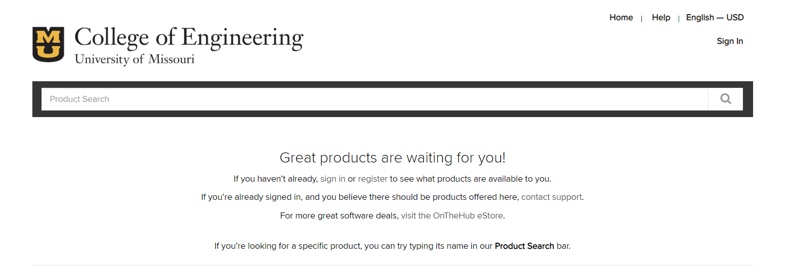
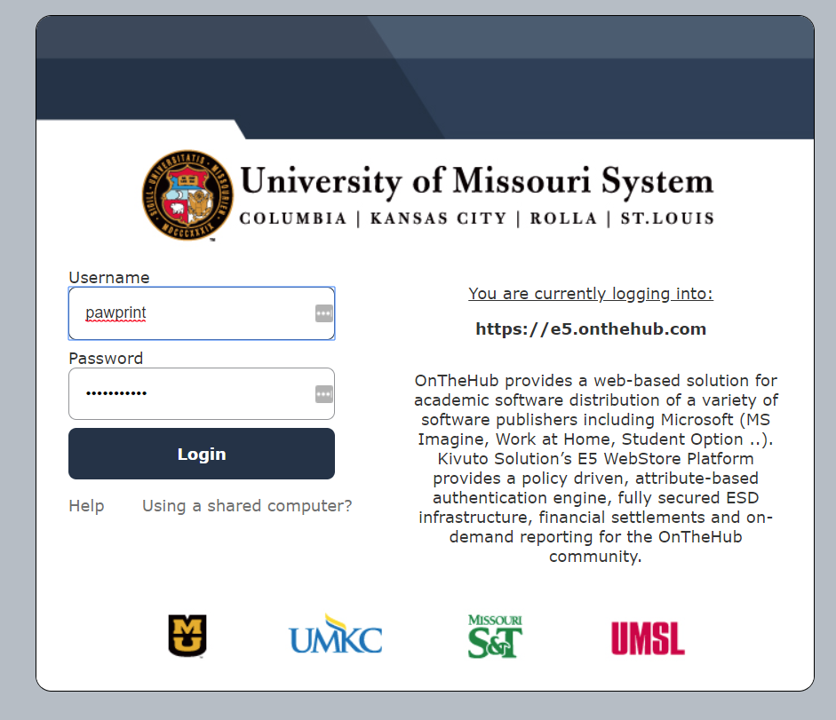
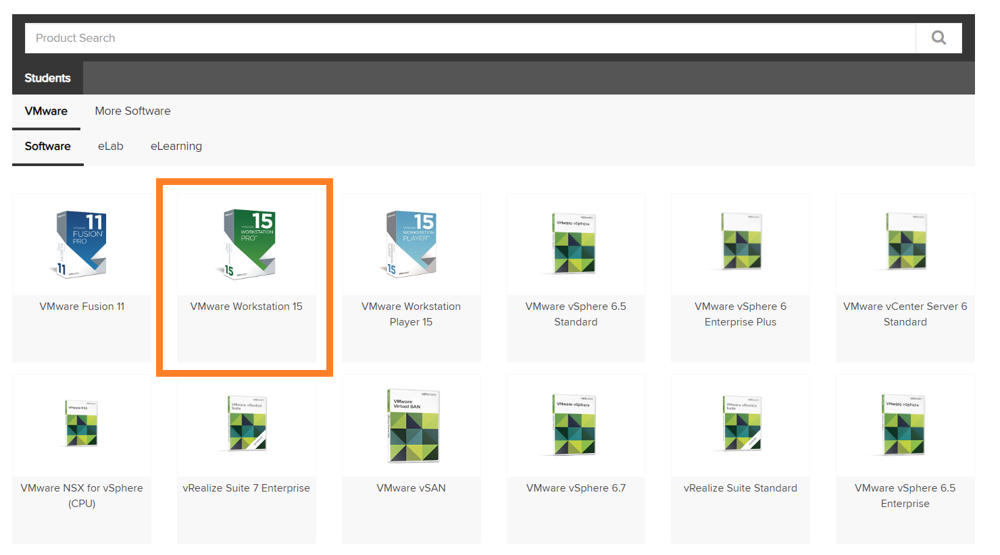
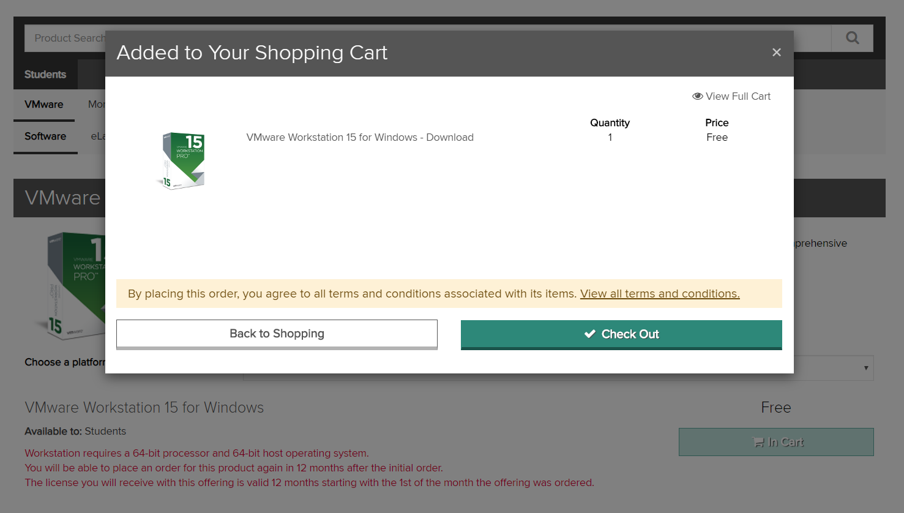
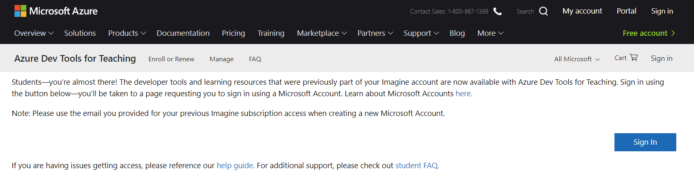
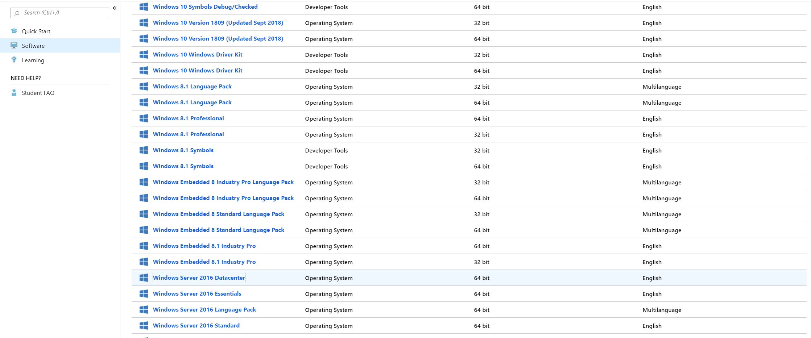

# Required Software

#### __[Required Software](PART1.md)__ | __[Installing Servers](PART2.md)__ | __[Things To Do](PART3.md)__
---

##### Navigate to Mizzou's software hub.

#### **[Software Hub](https://e5.onthehub.com/WebStore/ProductsByMajorVersionList.aspx?ws=e9adeca3-0c29-de11-a497-0030485a8df0&vsro=8)**

##### Sign in with your Canvas login credentials.

##### Navigate to VMware downloads. Then download VMware Workstation (Pro) 15

     

##### Add to cart and check out. All items in this hub are free!

   

##### You will then be given a product key (Hold on to this!). There will also be a download button for the software itself. Download and install with default settings     

##### This site only has certain applications now. For any Microsoft product you will need to navigate to the other software hub.

#### **[Microsoft Hub](https://azureforeducation.microsoft.com/devtools)**

   

##### Sign in with your school email credentials.

##### Then download Windows Server 2016 Datacenter. The datacenter version has the most features to play with. Also make sure to save the key again!

  

##### If you want a Linux server you can get your distro of choice. I've linked a few of the popular ones.

- ##### [CentOS](https://www.centos.org/download/)
- ##### [Ubuntu Server](https://www.ubuntu.com/download/server)
- ##### [Red Hat](https://developers.redhat.com/products/rhel/download/)
- ##### [Debian](https://www.debian.org/distrib/netinst)
---
#### __[<-](README.md)__ Section __[->](PART2.md)__
