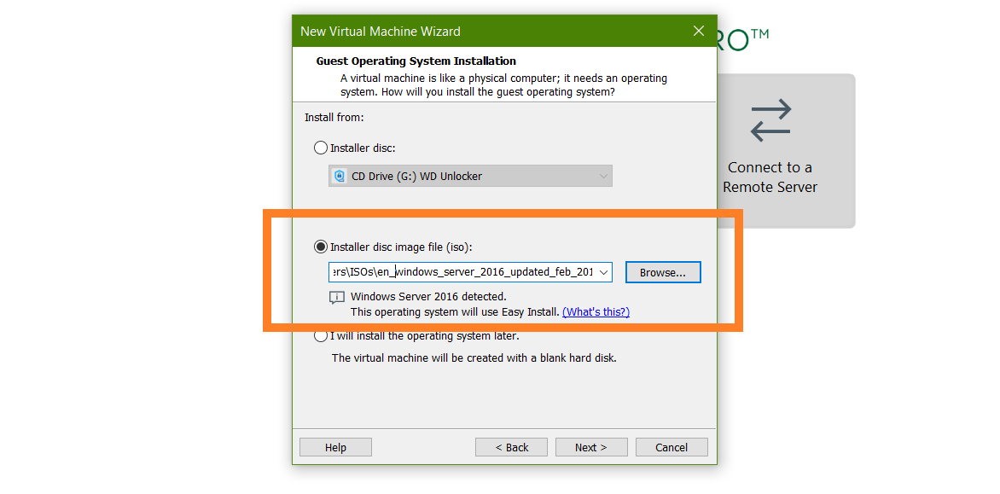
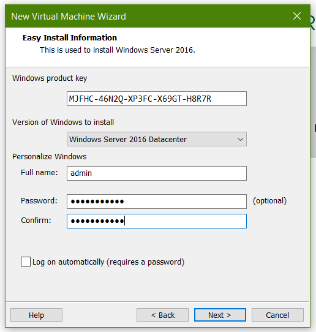
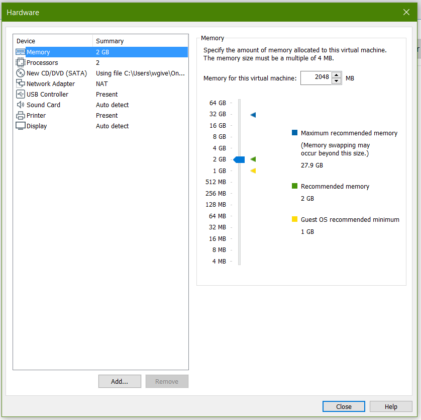
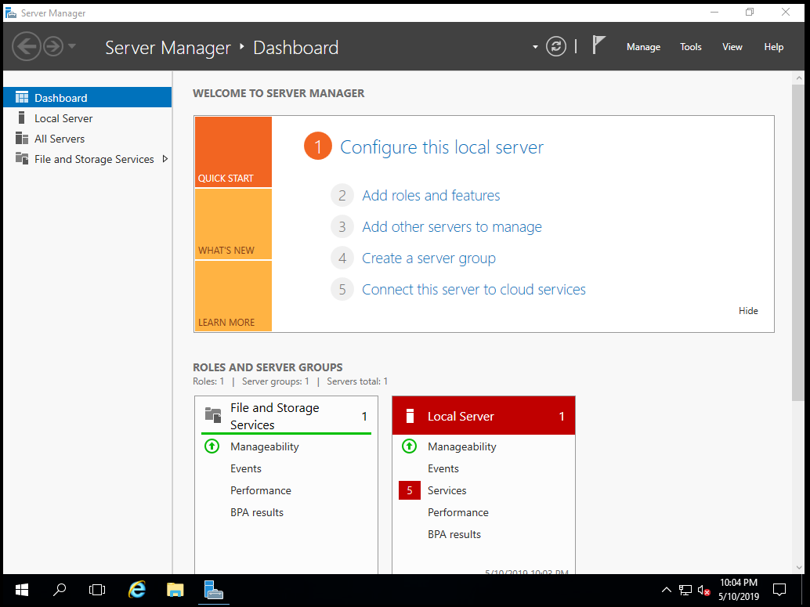

# Installing Servers

#### __[Required Software](PART1.md)__ | __[Installing Servers](PART2.md)__ | __[Things To Do](PART3.md)__

---

##### Once you've installed VMware workstation create a new VM.

##### Select the ISO file for the server that you downloaded.

##### Enter your key and set credentials.

##### Customize the server setting. Set according to your fit your beast or potato of a computer.

##### Then fire up Windows!

##### The same process applies for installing any Linux distro.

---

#### __[<-](PART1.md)__ Section __[->](PART3.md)__
