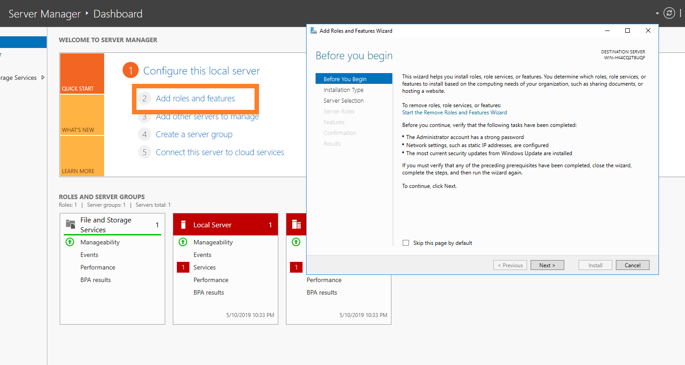
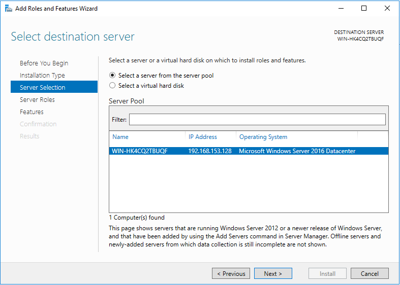
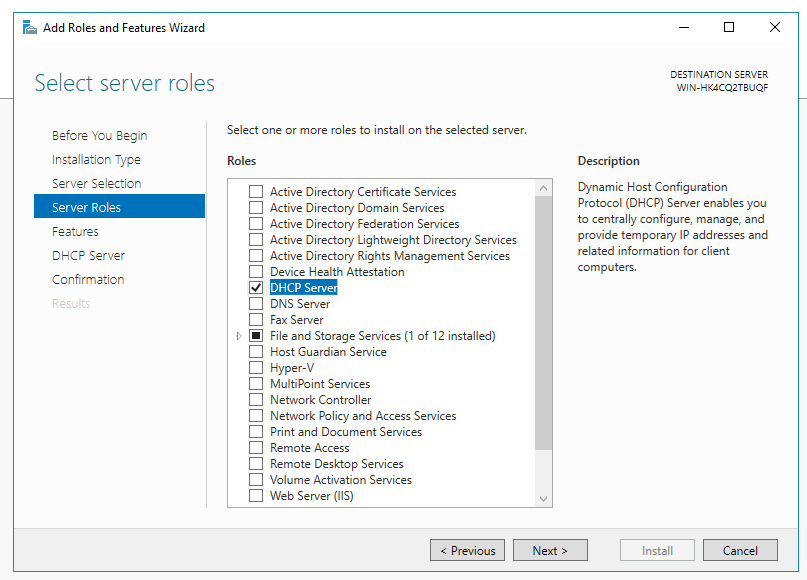
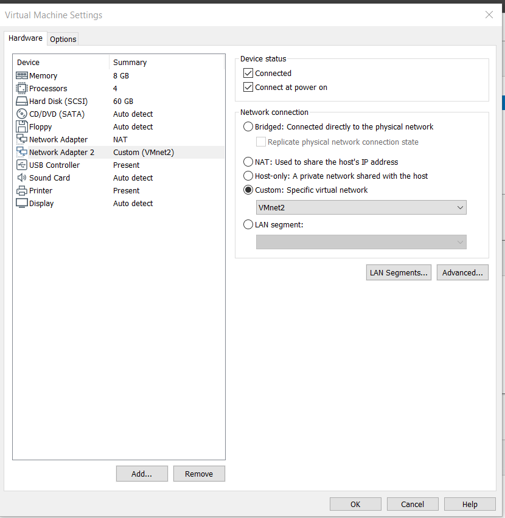
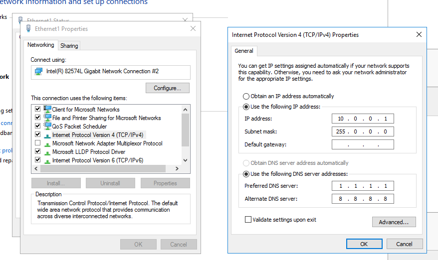
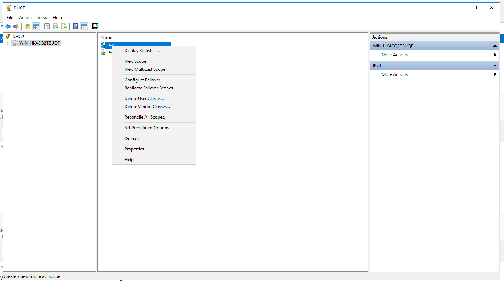
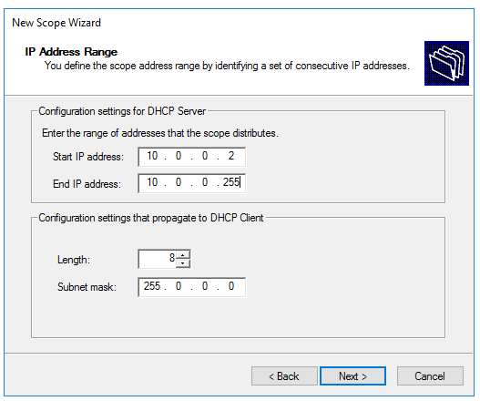
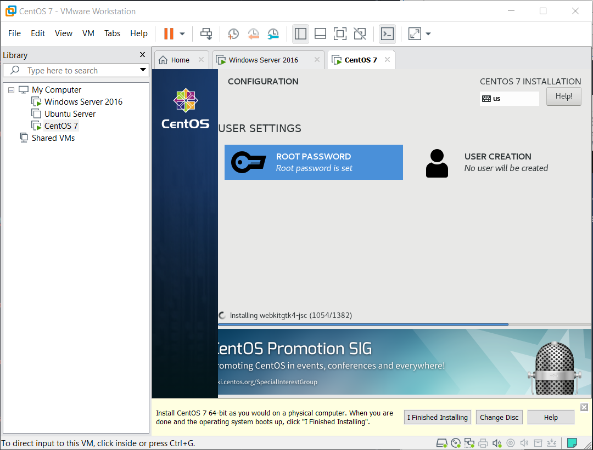

# Things To Do

#### __[Required Software](PART1.md)__ | __[Installing Servers](PART2.md)__ | __[Things To Do](PART3.md)__

---

##### To start using your Windows server add some roles! You do this by opening the Server Manager application and clicking add roles.

##### Chose Role-Based installation

##### Select this server

##### And install DHCP server

##### Then in VMware Workstation add another network adapter and put it on vmnet 2.

##### Then configure the new adapter in windows.

##### Then go to the DHCP server manager and create a new scope.

##### Set the range for the available addresses and create the scope.

##### Create another server. I chose centos

---

#### __[<-](PART2.md)__ Section __[->](PART3.md)__
