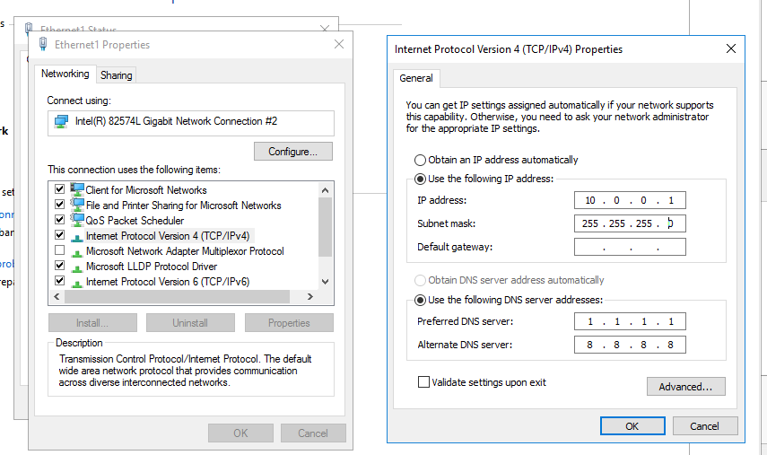

# Virtual Network and DHCP Server

#### __[Required Software](PART1.md)__ | __[Installing Servers](PART2.md)__ | __[DHCP Server](PART3.md)__

---

##### Here I will show you how to create a virtual network with a DHCP server.

##### First create a new virtual network for your servers. Go to the view -> network editor. Add a new network VMnet2 and set the settings.

##### Then in VMware Workstation add another network adapter and put it on vmnet 2.

##### To start using your Windows server add some roles! You do this by opening the Server Manager application and clicking add roles.

##### Chose Role-Based installation

##### Select this server

##### And install DHCP server

##### Then configure the new adapter in windows.

##### Then go to the DHCP server manager and create a new scope.

##### Set the range for the available addresses and create the scope.

##### Create another server. I chose centos

##### Make sure to set the network adapter to VMnet2.

##### Once booted on that net work it will get an IP from the Windows Server!

##### You can also see this in the Windows Server

---

#### __[<-](PART2.md)__ Section __[->](README.md)__
